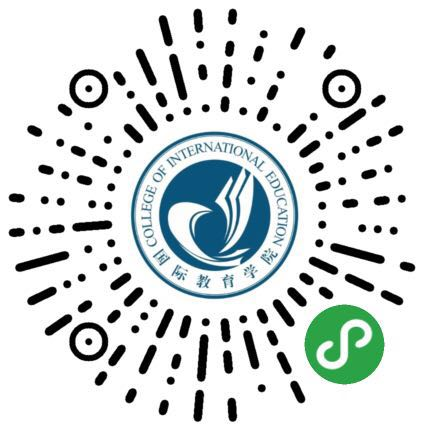

# 国教预约项目-后端应用

## 项目简介

国教预约项目是给浙江工商大学国际教育学院开发一块针对留学生办理各种手续的预约项目。即用户在办理业务前，需要在官方小程序上进行预约，以提高学院行政部门的办事效率，落实学校的"最多跑一次"政策。
此项目代码是小程序端的后台接口。

## 项目入口

## 后台管理系统

[后台管理系统](http://appoint.sinaapp.com/admin.php)

